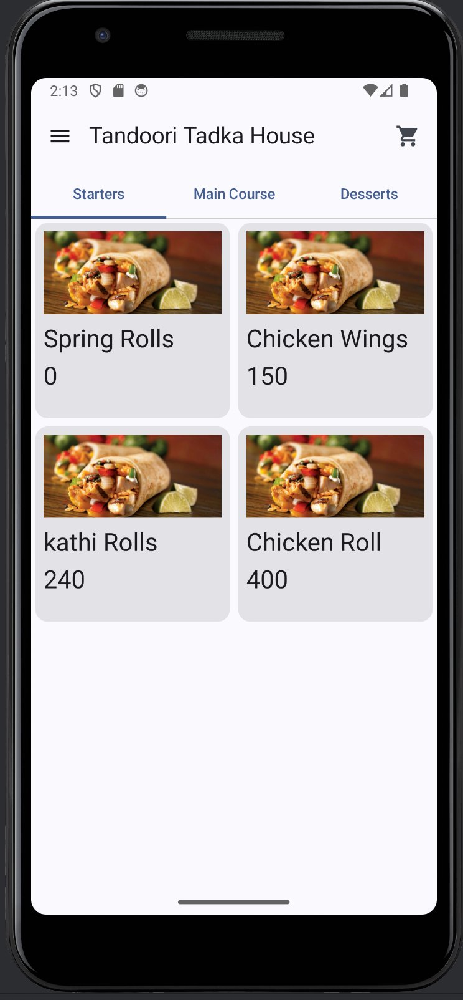
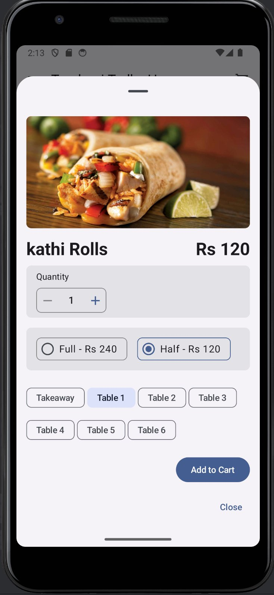
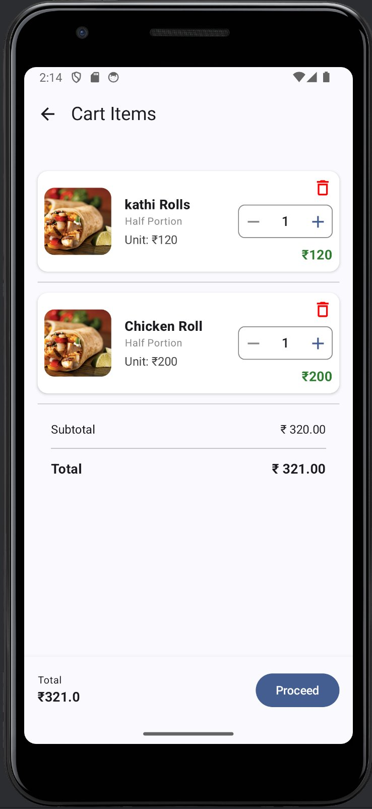
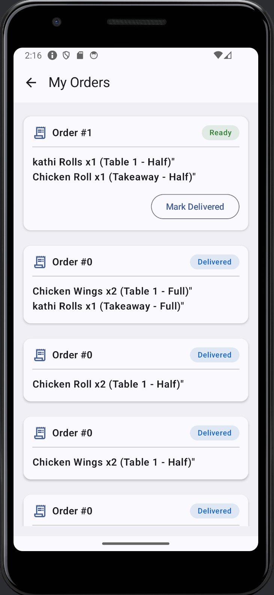

# 🍽️ Tandoori Tadka House — Restaurant Order Management

[](https://android.com)
[](https://kotlinlang.org)
[](https://developer.android.com/jetpack/compose)
[](https://developer.android.com/topic/architecture)
[](https://firebase.google.com)
[](LICENSE)

> An Android order-management app **built for and running in a real restaurant**. Reception takes orders; the kitchen and tandoor stations see only what they need to cook — with real-time Firestore sync and an offline-first menu.

---

## 📱 Screenshots

<table>
  <tr>
    <td align="center"><b>Menu</b></td>
    <td align="center"><b>Item Detail</b></td>
    <td align="center"><b>Cart</b></td>
    <td align="center"><b>Orders</b></td>
  </tr>
  <tr>
    <td></td>
    <td></td>
    <td></td>
    <td></td>
  </tr>
</table>

---

## 🎯 What makes it different — role-based, station-aware workflow

This isn't a demo cart app. It models how a real kitchen actually runs.

- **Device roles** — on first launch each device is set up as **Reception** or **Kitchen** (PIN-protected switch). A Kitchen device shows *only* the orders screen; everything else is hidden.
- **Station routing** — inside Kitchen, orders split into **Tandoor** and **Kitchen** tabs. Each order item is routed by type (tandoori snacks, breads, tikka, tandoori momos, thali → Tandoor; the rest → Kitchen).
- **Independent per-station "Ready"** — the tandoor marking its part ready does **not** clear the kitchen's part, and vice-versa. Solves the real problem of one station closing another's ticket.
- **Reception fulfillment flow** — a *Serve & Payment* screen with type-aware steps:
  - **Takeaway:** Payment Taken → Delivered
  - **Dine-in:** Serving on Table → Payment Collected
- **Call Kitchen** — reception taps a button, the kitchen device **rings** with the message ("Order ready?", "Jaldi karo", custom) — a cross-device attention signal over Firestore.

---

## ✨ Features

### 🛒 Ordering
- **Dine-in** (table-wise, Table 1–6) and **Takeaway**
- **Half / Full** portion selection with dynamic pricing
- Quantity control with live total; add / update / remove in cart
- **One-tap order** straight from the cart

### 📋 Menu
- **12 categories** served from **Firebase Firestore**
- **Offline-first** — cached in Room; re-fetched only when the menu version changes
- Dish images + item-detail bottom sheet (portion & table selection)

### 👨‍🍳 Kitchen
- Tandoor / Kitchen station tabs with keyword-based item routing
- Independent per-station "Mark Ready" with Preparing / Ready state

### 🧾 Reception
- Serve & Payment flow (takeaway vs dine-in steps)
- Call Kitchen attention alarm

### 🔔 Notifications
- New-order local notification with **sound + vibration** (dedicated high-importance channel)

---

## 🏗️ Architecture

**Clean Architecture + MVVM**, one-way data flow with `StateFlow` + Coroutines.

```
app/
├── data/
│   ├── local/        ← Room DB, DAOs, entities (offline cache)
│   ├── remote/       ← Firebase Firestore data sources
│   ├── mapper/       ← entity ⇄ domain ⇄ DTO mappers
│   └── repository/   ← Repository implementations
├── domain/
│   ├── model/        ← Order, CartItem, CartSummary, Address, CallSignal…
│   ├── pricing/      ← CartPricing (single source of truth for money math)
│   ├── repo/         ← Repository interfaces
│   └── usecase/      ← PlaceOrder, CalculateCartSummary, LoadMenu…
├── ui/               ← Jetpack Compose screens, ViewModels, navigation
├── utils/            ← NotificationHelper, DateProvider…
└── di/               ← Hilt modules
```

---

## 🧪 Unit Tests

**JUnit 5 + MockK + kotlinx-coroutines-test** on the pure domain layer (no Android deps):

```
✅ PlaceOrderUseCase          — 15 tests  (happy / edge / error / execution-order)
✅ CalculateCartSummaryUseCase —  8 tests  (subtotal, tax, empty-cart invariants)
```

Covers the happy path (dine-in & takeaway), edge cases (empty cart, null address fields, zero price/qty) and failure cases (Firebase / DB / cart-fetch errors), and verifies the exact order of side effects.

```bash
./gradlew testDebugUnitTest
```

---

## 🛠️ Tech Stack

| Category | Technology |
|---|---|
| Language | Kotlin 2.0 |
| UI | Jetpack Compose + Material 3 |
| Architecture | Clean Architecture + MVVM |
| DI | Hilt (Dagger) |
| Local cache | Room (offline-first) |
| Backend | Firebase Firestore (menu, order sync, cross-device signals) |
| Image loading | Coil |
| Async | Kotlin Coroutines + Flow / StateFlow |
| Testing | JUnit 5 + MockK + Coroutines Test |
| Build | Gradle KTS + KSP + KAPT |

---

## 🚀 Getting Started

**Prerequisites:** Android Studio (Hedgehog+), JDK 17, a Firebase project with Firestore.

```bash
git clone https://github.com/sandeepsankla/RestaurantOrderTakingApp.git
cd RestaurantOrderTakingApp
```

1. Add your `google-services.json` to `app/`.
2. Seed the menu: a `menus/default` document in Firestore (`menuVersion` + `categories`). A Node upload script lives in `scripts/`.
3. Build & run:

```bash
./gradlew assembleDebug
```

On first launch, pick **Reception** or **Kitchen** and set a 4-digit PIN.

---

## 📐 Key Design Decisions

### Single source of truth for pricing
Cart summary and the placed-order total both flow through one `CartPricing` object, so the amount a customer sees can never drift from the amount that's stored.

```kotlin
object CartPricing {
    const val TAX_RATE: Double = 0.0            // one knob for tax
    fun subtotal(items: List<CartItem>) = items.sumOf { it.totalPrice }
    fun tax(subtotal: Int) = (subtotal * TAX_RATE).roundToInt()
    fun total(subtotal: Int) = subtotal + tax(subtotal)
}
```

### Order business logic isolated in a UseCase
Independently testable, no Android dependencies:

```kotlin
class PlaceOrderUseCase @Inject constructor(
    private val cartRepository: CartRepository,
    private val orderRepository: OrderRepository,
    private val orderSyncRepository: OrderSyncRepository,
    private val notificationHelper: NotificationHelper
) {
    suspend operator fun invoke(address: Address) {
        // validate cart → map to order items → total (CartPricing)
        // create order (Room) → push to Firestore → notify → clear cart
    }
}
```

### Offline-first menu
The menu is read from Room and only re-fetched from Firestore when the remote `menuVersion` differs — the app stays usable on a dead network.

---

## 👨‍💻 Author

**Sandeep Sankla** — Android Engineer
[LinkedIn](https://linkedin.com/in/sandeep-sankla) · [GitHub](https://github.com/sandeepsankla)

---

## 📄 License

MIT License — see [LICENSE](LICENSE) for details.
