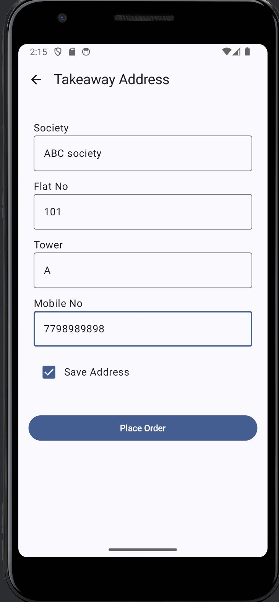

# 🍽️ Tandoori Tadka House — Restaurant Order Taking App

[](https://android.com)
[](https://kotlinlang.org)
[](https://developer.android.com/jetpack/compose)
[](https://developer.android.com/topic/architecture)
[](https://firebase.google.com)
[](LICENSE)

> A production-grade Android application for restaurant order management — supporting both **Dine-In** (table-wise) and **Takeaway** ordering with real-time Firebase sync and offline-first architecture.

---

## 📱 Screenshots

<table>
  <tr>
    <td align="center"><b>Menu</b></td>
    <td align="center"><b>Item Detail</b></td>
    <td align="center"><b>Cart</b></td>
    <td align="center"><b>Address</b></td>
    <td align="center"><b>My Orders</b></td>
  </tr>
  <tr>
    <td></td>
    <td></td>
    <td></td>
    <td></td>
    <td></td>
  </tr>
</table>

---

## ✨ Features

### 🛒 Ordering
- **Dine-In ordering** — table-wise order placement (Table 1–6)
- **Takeaway ordering** — with delivery address capture
- **Half / Full portion** selection per item with dynamic pricing
- **Quantity control** — increment / decrement with real-time total update
- **Cart management** — add, remove, update items before checkout

### 📋 Menu
- **Category-based menu** — Starters, Main Course, Desserts
- **Item detail bottom sheet** — image, price, portion & table selection
- **Real-time menu** fetched from Firebase Firestore

### 📦 Order Management
- **Real-time order status** — Pending → Ready → Delivered
- **Mark as Delivered** — one-tap order completion
- **Order history** — complete list of all past orders
- **Instant Firebase push** on every new order

### 🔔 Notifications
- **New order notifications** — triggered on successful order placement
- Background sync via WorkManager

---

## 🏗️ Architecture

This app follows **Clean Architecture** with **MVVM** pattern:

```
app/
├── data/
│   ├── local/          ← Room Database (offline-first)
│   ├── remote/         ← Firebase Firestore
│   └── repository/     ← Repository implementations
├── domain/
│   ├── model/          ← Data models (Order, CartItem, Address...)
│   ├── repository/     ← Repository interfaces
│   └── usecase/        ← Business logic (PlaceOrderUseCase, etc.)
├── presentation/
│   ├── viewmodel/      ← ViewModels (StateFlow + Coroutines)
│   └── ui/             ← Jetpack Compose screens
└── di/                 ← Hilt dependency injection modules
```

---

## 🧪 Unit Tests

Comprehensive unit test suite using **JUnit 5 + MockK + Coroutines Test**:

```
✅ PlaceOrderUseCase  — 14 test cases
✅ CartItem           —  3 test cases (computed price properties)
✅ OrderItem          —  2 test cases (portion logic)
```

**Test coverage includes:**
- Happy path — successful order placement (dine-in & takeaway)
- Edge cases — empty cart, null address fields, zero price
- Error cases — Firebase failure, DB error, cart fetch failure
- Execution sequence — correct order of operations verified

```bash
./gradlew testDebugUnitTest
```

---

## 🛠️ Tech Stack

| Category | Technology |
|---|---|
| Language | Kotlin 1.9 |
| UI | Jetpack Compose + Material 3 |
| Architecture | Clean Architecture + MVVM |
| DI | Hilt (Dagger) |
| Database | Room (offline-first) |
| Backend | Firebase Firestore + Realtime DB |
| Notifications | Firebase FCM |
| Networking | Retrofit + OkHttp |
| Image Loading | Coil |
| Async | Kotlin Coroutines + Flow |
| Testing | JUnit 5 + MockK + Coroutines Test |
| Build | Gradle KTS + KSP |

---

## 🚀 Getting Started

### Prerequisites
- Android Studio Hedgehog or newer
- JDK 17+
- Firebase project (Firestore enabled)

### Setup

**1. Clone the repo**
```bash
git clone https://github.com/sandeep-sankla/RestaurantOrderTakingApp.git
cd RestaurantOrderTakingApp
```

**2. Add Firebase config**
```
Download google-services.json from Firebase Console
→ Place it in app/ folder
```

**3. Build & Run**
```bash
./gradlew assembleDebug
```

---

## 📐 Key Design Decisions

### Offline-First Architecture
Orders are saved to **Room DB first**, then synced to Firebase — ensuring the app works even with poor connectivity.

### PlaceOrderUseCase
Core business logic is fully isolated in a single UseCase — making it independently testable without Android dependencies:

```kotlin
class PlaceOrderUseCase @Inject constructor(
    private val cartRepository: CartRepository,
    private val orderRepository: OrderRepository,
    private val orderSyncRepository: OrderSyncRepository,
    private val notificationHelper: NotificationHelper
) {
    suspend operator fun invoke(address: Address) {
        // 1. Validate cart
        // 2. Map cart items → order items
        // 3. Calculate total
        // 4. Create order (Room + Firestore)
        // 5. Sync to Firebase instantly
        // 6. Show notification
        // 7. Clear cart
    }
}
```

### Half / Full Portion Pricing
Dynamic unit price computed as a property — no redundant storage:

```kotlin
val unitPrice: Int
    get() = if (portion == PortionType.FULL) fullPrice else halfPrice

val totalPrice: Int
    get() = unitPrice * quantity
```

---

## 🤝 Contributing

Pull requests are welcome! For major changes, please open an issue first.

---

## 👨‍💻 Author

**Sandeep Sankla**
Senior Android Engineer | 9+ years experience
[LinkedIn](https://linkedin.com/in/sandeep-sankla) · [GitHub](https://github.com/sandeep-sankla)

---

## 📄 License

MIT License — see [LICENSE](LICENSE) for details.
